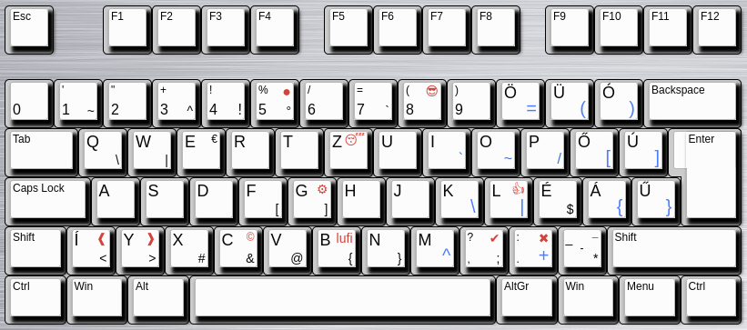

# keyboard-SyS

hungarian keyboard for developers

A magyar ISO 105 gombos billentyűzeten (számomra) fölösleges karakterek helyett a nehezebben gépelhető karakterek kaptak helyet, hogy azokat könnyebb legyen gépelni. A kiosztás remekül működik a nem 105 gombos laptopomon is.

Meg még pár apróság:

- ● pötty
- ⚙ gear
- 👍 like
- – gondolat jel
- ❰❱✔✖
- 🎈 emoji lufi :)
- 😎😴



[kiosztás](<http://www.keyboard-layout-editor.com/?fbclid=IwAR3YtRVJ-5VjJWcKMMDVdrcav5dA4Sc5tyev1wvMugAMIVX9bjsemJg66UQ##@_background_name=Aluminium%20brushed&style=background-image%2F:%20url('%2F%2Fbg%2F%2Fmetal%2F%2Faluminum%2F_texture1642.jpg')%2F%3B&$$hashKey=07I%3B&css=.keylabels%20%7B%0A%20%20%20%20box-shadow%2F:%204px%205px%204px%202px%20black%2F%3B%0A%7D%0A%23keyboard-bg%20div%20%7B%0A%20%20%20%20border%2F:none%2F%3B%0A%7D%3B&@=Esc&_x:1%3B&=F1&=F2&=F3&=F4&_x:0.5%3B&=F5&=F6&=F7&=F8&_x:0.5%3B&=F9&=F10&=F11&=F12&_x:0.25%3B&=PrtSc&=Scroll%20Lock&=Pause%0ABreak%3B&@_y:0.5&f2:5%3B&=%0A0&_fa@:0&:5&:5&:4%3B%3B&='%0A1%0A%0A~&=%22%0A2&=+%0A3%0A%0A%5E&_f2:5%3B&=!%0A4%0A%0A!&_t=%23000000%0A%0A%23b82828&sm=cherry&fa@:0&:5&:5&:4%3B%3B&=%25%0A5%0A%E2%97%8F%0A%C2%B0&_t=%23000000%3B&=%2F%2F%0A6&=%2F=%0A7%0A%0A%60&_t=%23000000%0A%0A%23b82828&fa@:0&:5&:4%3B%3B&=(%0A8%0A%F0%9F%98%8E&_t=%23000000%3B&=)%0A9&_t=%23000000%0A%0A%0A%230066ff&fa@:6&:5&:4&:7%3B%3B&=%C3%96%0A%0A%0A%2F=&=%C3%9C%0A%0A%0A(&=%C3%93%0A%0A%0A)&_t=%23000000&f:3&w:2%3B&=Backspace&_x:0.25&f:3%3B&=Insert&_f:3%3B&=Home&_f:3%3B&=PgUp&_x:0.25&f:3%3B&=Num%20Lock&_a:7&fa@:7%3B%3B&=%2F%2F&=*&=-%3B&@_a:4&f:3&w:1.5%3B&=Tab&_fa@:6&:0&:0&:4%3B%3B&=Q%0A%0A%0A%5C&=W%0A%0A%0A%7C&=E%0A%0A%E2%82%AC&=R&=T&_t=%23000000%0A%0A%23b82828&fa@:6&:0&:4%3B%3B&=Z%0A%0A%F0%9F%98%B4&_t=%23000000%3B&=U&_t=%23000000%0A%0A%0A%23045dcc&fa@:6&:0&:4&:5%3B%3B&=I%0A%0A%0A%60&=O%0A%0A%0A~&=P%0A%0A%0A%2F%2F&_t=%23000000%0A%0A%0A%230066ff&fa@:6&:0&:4&:7%3B%3B&=%C5%90%0A%0A%0A%5B&=%C3%9A%0A%0A%0A%5D&_x:0.25&t=%23000000&f:3&w:1.25&h:2&w2:1.5&h2:1&x2:-0.25%3B&=Enter&_x:0.25&f:3%3B&=Delete&_f:3%3B&=End&_f:3%3B&=PgDn&_x:0.25&f:3%3B&=7%0AHome&_f:3%3B&=8%0A%E2%86%91&_f:3%3B&=9%0APgUp&_a:7&fa@:7%3B&h:2%3B&=+%3B&@_a:4&f:3&w:1.75%3B&=Caps%20Lock&_fa@:6%3B%3B&=A&=S&=D&_fa@:6&:0&:0&:4%3B%3B&=F%0A%0A%0A%5B&_t=%23000000%0A%0A%23b82828&fa@:6&:0&:4&:4%3B%3B&=G%0A%0A%E2%9A%99%0A%5D&_t=%23000000%3B&=H&=J&_t=%23000000%0A%0A%0A%230066ff&fa@:6&:0&:4&:7%3B%3B&=K%0A%0A%0A%5C&_t=%23000000%0A%0A%23b82828%0A%230066ff%3B&=L%0A%0A%F0%9F%91%8D%0A%7C&_t=%23000000&fa@:6&:0&:4&:4%3B%3B&=%C3%89%0A%0A%0A$&_t=%23000000%0A%0A%0A%230066ff&fa@:6&:0&:4&:7%3B%3B&=%C3%81%0A%0A%0A%7B&=%C5%B0%0A%0A%0A%7D&_x:4.75&t=%23000000&f:3%3B&=4%0A%E2%86%90&_f:3%3B&=5&_f:3%3B&=6%0A%E2%86%92%3B&@_f:3&w:1.25%3B&=Shift&_t=%23000000%0A%0A%23b82828&fa@:6&:0&:4&:4%3B%3B&=%C3%8D%0A%0A%E2%9D%B0%0A%3C&=Y%0A%0A%E2%9D%B1%0A%3E&_t=%23000000%3B&=X%0A%0A%0A%23&_t=%23000000%0A%0A%23b82828&fa@:6&:0&:0&:4%3B%3B&=C%0A%0A%C2%A9%0A%2F&&_t=%23000000%3B&=V%0A%0A%0A%2F@&_t=%23000000%0A%0A%23b82828&fa@:6&:0&:4&:4%3B%3B&=B%0A%0Alufi%0A%7B&_t=%23000000%3B&=N%0A%0A%0A%7D&_t=%23000000%0A%0A%0A%230066ff&fa@:6&:0&:4&:7%3B%3B&=M%0A%0A%0A%5E&_t=%23000000%0A%0A%23b82828&fa@:0&:0&:4&:4%3B%3B&=%3F%0A,%0A%E2%9C%94%0A%2F%3B&_t=%23000000%0A%0A%23b82828%0A%230066ff&fa@:0&:0&:4&:7%3B%3B&=%2F:%0A.%0A%E2%9C%96%0A+&_t=%23000000%0A%0A%23b82828&fa@:4&:0&:0&:4%3B%3B&=%2F_%0A%0A%E2%80%93%0A*%0A%0A%0A%0A%0A%0A-&_t=%23000000&f:3&w:2.75%3B&=Shift&_x:1.25&a:7&fa@:9%3B%3B&=%E2%86%91&_x:1.25&a:4&f:3%3B&=1%0AEnd&_f:3%3B&=2%0A%E2%86%93&_f:3%3B&=3%0APgDn&_f:3&h:2%3B&=Enter%3B&@_f:3&w:1.25%3B&=Ctrl&_f:3&w:1.25%3B&=Win&_f:3&w:1.25%3B&=Alt&_a:7&w:6.25%3B&=&_a:4&f:3&w:1.25%3B&=AltGr&_f:3&w:1.25%3B&=Win&_f:3&w:1.25%3B&=Menu&_f:3&w:1.25%3B&=Ctrl&_x:0.25&a:7&f:3%3B&=%E2%86%90&_f:3%3B&=%E2%86%93&_f:3%3B&=%E2%86%92&_x:0.25&a:4&f:3&w:2%3B&=0%0AIns&_f:3%3B&=.%0ADel>) (Kék AltGr, Piros Shift+AltGr)

A telepítő grafikus környezethez van kitalálva. A telepítéshez nem kell rendszergazda jog. Bejelentkezés után egy python program betölti a kiosztást, és figyel, ha USB billentyűzetet csatlakoztatnak, hogy újra betöltse.

## Telepítés

A telepítő display manager-es környezetben működik. Ha startx-et használsz, akkor az autostart script a desktop fileból menjen a .xinitrc-be

```bash
./install.sh
```
